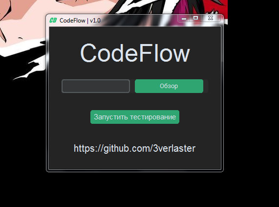
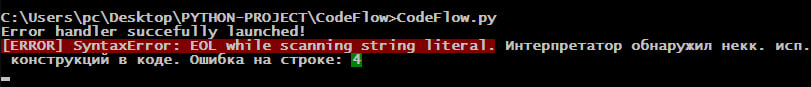

# CodeFlow
Этот репозиторий содержит код программы с Error Handler (обработчиком ошибок) для Python. Error Handler предназначен для обнаружения и обработки различных типов ошибок, которые могут возникнуть при выполнении Python программы.

Основная функция - run_and_debug() запускает программу и осуществляет отладку. В случае возникновения ошибок, Error Handler анализирует сообщения об ошибках и выводит информацию о них, включая тип ошибки, текст ошибки и номер строки, на которой произошла ошибка.

Все ошибки которые запланированы для обнаружения в будущих обновлениях записаны в файл error_messages.

